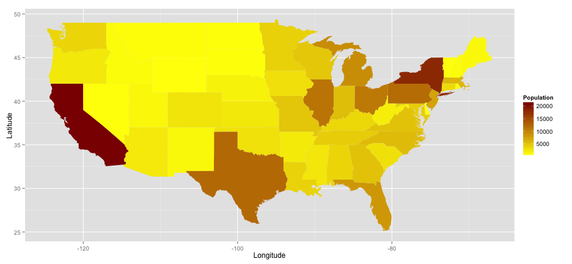

## Dataset

1. I used data from the state dataset available within R.
2. Specifically the visualization will be for the dataset state.x77.
3. I concentrated on the first five columns - Population, Income, Illiteracy, Life Expectancy and Murder rate.

```r
data(state)

# Display the first few entries in activity data frame
head(state.x77[, 1:5])
```

```
##            Population Income Illiteracy Life Exp Murder
## Alabama          3615   3624        2.1    69.05   15.1
## Alaska            365   6315        1.5    69.31   11.3
## Arizona          2212   4530        1.8    70.55    7.8
## Arkansas         2110   3378        1.9    70.66   10.1
## California      21198   5114        1.1    71.71   10.3
## Colorado         2541   4884        0.7    72.06    6.8
```

--- .class #id 

## Generating gradient fill maps

1. I used the maps and ggplot2 packages to visualize the data. 
2. For every variable of interest, I created a gradient of fill colors where the intensity of each state is in accordance with the value of that variable for that state.
 

--- .class #id 

## Generating data tables

1. In addition to visualizing data on the map, we can read off the data values from the tables that are generated for each variable.
2. This data is searchable by state (due to the nature of data table structure, the search is case sensitive) and by value of the chosen variable.
3. The data can be sorted alphabetically by state name or numerically by value of the variable.

--- .class #id 

## Computing correlations between variables

1. I have provided an easy interface to compute the correlation coefficient between the values of any two chosen variables.
2. Two variables can be chosen from drop down menus.
3. The correlation coefficient will be displayed at the bottom.
4. As an example we compute the correlation coefficient between Population and Income values for US states:

```r
data(state)
state_data <- data.frame(state.x77)
cor(state_data$Population, state_data$Income)
```

```
## [1] 0.2082
```

